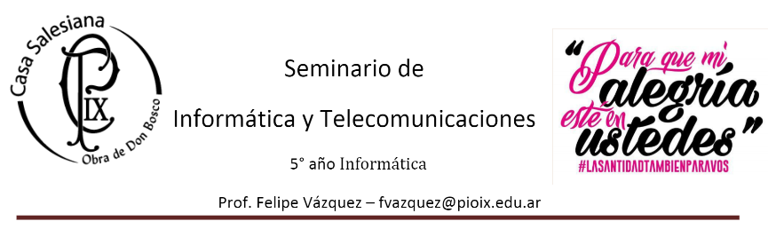

# _**Guía JS para Gatos**_
## _**(https//JSPARAGATOS.COM/)**_

* **1- ¿Qué fue lo que más te gustó de la guía?:ok_hand:

  Lo básico y simple que es Git para trabajar con texto plano y el hecho de que el formato sea compatible con cualquier plataforma.

* **2- ¿Qué fue lo más fácil?:thumbsup:

  Modificar el texto a negrita y a italic.
  
* **3- ¿Qué fue lo más difícil?:-1:

  Cargar imágenes ya que al principio no había entendido bien cómo funcionaba.

* **4- ¿Qué conocías de otros lenguajes(nombrar el lenguaje)?:no_mouth:

  Conocía por ejemplo el h1 del html que es como el "#". Del VisualBasic conocía El Image.FromFile("Archivo.jpg") que se asemeja al código para cargar una imagen aca en Git.

* **5- ¿Qué es diferente de otros lenguajes(nombrar el lenguaje)?:neutral_face:

  La manera de codificar los elementos como por ejemplo en html el "h1" en vez de programarse así también se puede programar con un "#". Una de las diferencias además es que Git permite la visualización del historial de cambios. Otra es que varias personas pueden acceder y modificar mediante la nube el repositorio (esto no sucede en html, en vb o en Java Script).

* **6- ¿Cuáles son los Tips que da el autor para ser un buen programador?:smile:

  
